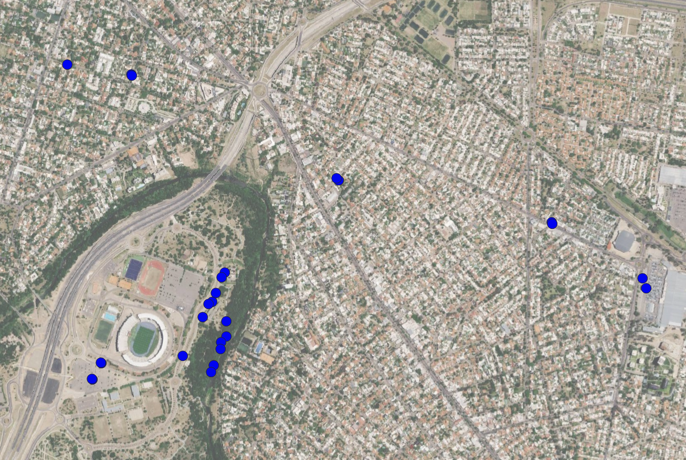

## MRT Validation with ground data – Córdoba, Argentina

In this section, ground data is used to validate results of MRT estimating in Córdoba, Argentina 

#### Zone
Due to the limited time for measuring temperature, some neighborhoods/zones were selected for the validation: 

Residential zone: villa Belgrano, Villa Centenario

open parkings: Donosaurio Mall Alto Verde and Kempes' parking

Park: Parque del Kempes 

#### Measured and Derived Variables

- **TA**: Air temperature.
- **TG**: Globe temperature. Influenced by air temperature, wind speed, and radiative fluxes.
- **wind**: Wind speed in m/s.
- **MRT**: Mean Radiant Temperature. Derived from TG using TA, wind speed, and globe diameter.

---

### Instruments used

Field measurements were carried out using two black globe thermometers and two anemometers, allowing parallel measurements at different locations within the city.

#### Black Globe Thermometers
- **Thermometer 1:** Sper Scientific 800036 (40 mm globe)
- **Thermometer 2:** TM-188D TENMARS (50 mm globe)

#### Anemometers
- **Anemometer 1:** HP-878 cup anemometer
- **Anemometer 2:** TL-300 mini handheld anemometer

---

### Instrument Intercomparison

Since the instruments differ in brand and technical specifications, an intercomparison analysis was conducted before collecting validation data. Parallel measurements under identical environmental conditions were performed to quantify systematic differences.

 - in notebook `3.4.4.1.differences-t1-t2` the differences in Globe Temperature (TG) variable of the thermometers is analyzed
 - in notebook `3.4.4.2.wind-a1-a2` the difference in the wind speed variable of the anemometers is analyzed

Based on these analyses, correction criteria were defined to ensure comparable measurements.

---

### Shadow vs. Sun Exposure Test

To evaluate the effect of solar exposure on Globe Temperature (TG), both thermometers were placed at the same location (identical environmental context), with:
- One instrument under direct solar radiation
- The other instrument under shade

This information was used to re-estimate MRT based on LST and shadows

- `3.4.4.3.shadow-sun`

---

### MRT Validation

The final validation of predicted MRT values for Córdoba is performed in:

- `3.4.4.4.validation-2026`

This notebook integrates corrected ground measurements and compares them against modeled MRT.

