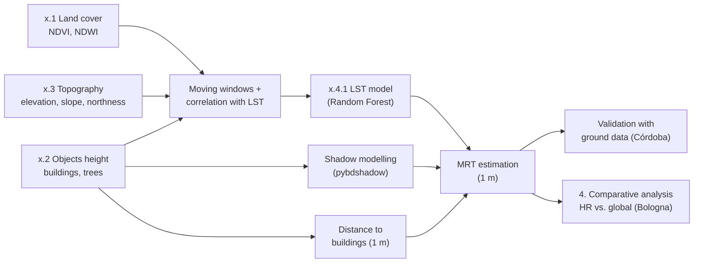

# Urban Thermal Adaptability Indicators

Code for the Master's thesis **"Estimation of urban thermal adaptability indicators with open global data: Córdoba and Bologna as case studies"** (*Estimación de indicadores de adaptabilidad térmica urbana con datos globales abiertos: Córdoba y Bolonia como casos de estudio*).

- **Author:** Guadalupe Sol Escalante
- **Degree:** Master in Applications of Spatial Information (*Magíster en Aplicaciones de Información Espacial*)
- **Institutions:** Instituto Mario (UNC-CONAE)
- **Supervisor:** Dr. Marco Pistore (FBK, Trento, Italy)
- **Co-supervisor:** Dr. Diego Pons (INTA, Córdoba, Argentina)

## General objective

To develop a methodology for the estimation of urban thermal adaptability indicators in contexts of extreme heat and limited high-resolution data (reference case: Córdoba, Argentina), validating its results through a deviation analysis against estimates using high-resolution data derived from an airborne survey in Bologna, Italy.

## Specific objectives

- **Objective 1:** To identify and map the territorial variables that may influence the thermal comfort of people in different spaces of the city of Córdoba, using open global data.
- **Objective 2:** To study the spatial correlation between the identified variables and the reference values and to build estimation models of urban thermal adaptability indicators for the city of Córdoba.
- **Objective 3:** To replicate the methodology for the estimation of urban thermal adaptability indicators in Bologna, using open global data and high-resolution data derived from an airborne survey.
- **Objective 4:** To evaluate the deviation of the results obtained using open global data with respect to those obtained using high-resolution data derived from that airborne survey in the city of Bologna, carrying out a comparative analysis of the results.

## Repository structure

The repository follows the order of the objectives. Each numbered folder is one case study (or the final comparison), and the notebooks inside are numbered in the order they should be run.

| Folder | Case study | Data | Objectives |
|---|---|---|---|
| [`1.global-data-cba/`](1.global-data-cba/) | Córdoba, Argentina | Open global data | 1, 2 |
| [`2.global-data-bologna/`](2.global-data-bologna/) | Bologna, Italy | Open global data | 3 |
| [`3.HR-data-bologna/`](3.HR-data-bologna/) | Bologna, Italy | High-resolution data from an airborne survey | 3 |
| [`4.comparative-analysis/`](4.comparative-analysis/) | Bologna, Italy | Results from folders 2 and 3 | 4 |

## Workflow

The three case studies follow the same workflow: territorial variables are derived at 30 m (the resolution of the Landsat thermal band), their spatial relation with Land Surface Temperature (LST) is analysed, an LST model is built, and the estimated LST is combined with shadows and distance to buildings to obtain the Mean Radiant Temperature (MRT) at 1 m.



## Data sources

| Variable | Córdoba (global) | Bologna (global) | Bologna (HR) |
|---|---|---|---|
| LST, NDVI, NDWI | Landsat 8, 2024-01-25 | Landsat 9, 2024-08-09 | LST: Landsat 9, 2024-08-09. NDVI, NDWI: airborne survey |
| Buildings | Global Building Atlas | Global Building Atlas | airborne survey/cadastre|
| Trees | Global Canopy Height | Global Canopy Height | airborne survey|
| Topography | FABDEM (30 m) | FABDEM (30 m) | airborne survey |

## Data folder

The input and output data are not included in the repository. The notebooks read and write them in a `datos-notebooks/` folder placed next to the repository, which mirrors the same numbering:

```
TESIS/
├── urban-thermal-adaptability-index/   (this repository)
└── datos-notebooks/
    ├── 1.global-data-cba/
    ├── 2.global-data-bologna/
    ├── 3.HR-data-bologna/
    │   ├── 3.0.base-data/
    │   ├── 3.1.land-cover/
    │   ├── 3.2.objects-height/
    │   ├── 3.3.topography/
    │   ├── 3.4.LST-prediction/
    │   └── 3.5.MRT-prediction/
    └── 4.comparative-analysis/
```

Paths are relative to each notebook (for example `../../../datos-notebooks/1.global-data-cba/`), so the notebooks must be run from their own folder.

